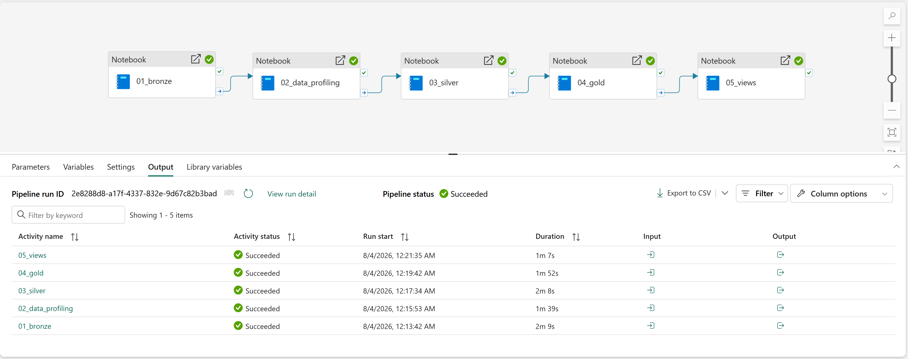
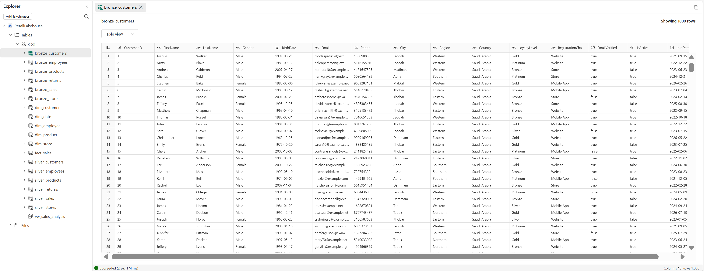

# Retail Fabric Data Engineering

An end-to-end **Data Engineering** project built with **Microsoft Fabric**, **PySpark**, **Delta Lake**, and the **Medallion Architecture**.

This project demonstrates a complete modern data engineering workflow, starting from synthetic retail data generation and ending with analytics-ready data stored in a Microsoft Fabric Lakehouse.

---

# Project Overview

This project simulates a real-world retail data platform using Microsoft Fabric.

The data engineering workflow follows the Medallion Architecture:

- Bronze Layer – Raw data ingestion
- Silver Layer – Data cleaning and validation
- Gold Layer – Dimensional modeling (Star Schema)
- SQL Views – Analytics-ready views
- Data Pipeline – End-to-end orchestration using Microsoft Fabric Pipelines

---

# Dataset

The dataset used in this project is **synthetically generated** and was created specifically for demonstrating end-to-end data engineering concepts.

The generator creates realistic retail data including:

- Customers
- Products
- Stores
- Employees
- Sales
- Returns

The complete datasets are generated locally using the notebook:

```
00_generate_data.ipynb
```

To keep this repository lightweight, only a **small sample** of the generated data is included in the `sample_data` directory.

---

# Technologies

- Microsoft Fabric
- OneLake
- Lakehouse
- PySpark
- Spark SQL
- Delta Lake
- Microsoft Fabric Pipelines
- SQL
- Medallion Architecture

---

# Project Structure

```
Retail-Fabric-Data-Engineering
│
├── notebooks
│   ├── 00_generate_data.ipynb
│   ├── 01_bronze.ipynb
│   ├── 02_data_profiling.ipynb
│   ├── 03_silver.ipynb
│   ├── 04_gold.ipynb
│   └── 05_views.ipynb
│
├── sample_data
│   ├── customers_sample.csv
│   ├── employees_sample.csv
│   ├── products_sample.csv
│   ├── returns_sample.csv
│   ├── sales_sample.csv
│   └── stores_sample.csv
│
├── screenshots
│   ├── lakehouse_tables.png
│   └── pipeline.png
│
└── README.md
```

---

# ETL Workflow

```
Synthetic Data
      │
      ▼
 Bronze Layer
      │
      ▼
 Data Profiling
      │
      ▼
 Silver Layer
      │
      ▼
 Gold Layer
      │
      ▼
 SQL Views
      │
      ▼
 Analytics
```

---

# Medallion Architecture

## Bronze Layer

- Load raw CSV files into the Lakehouse
- Preserve source data
- Store data as Delta tables

Tables:

- bronze_customers
- bronze_products
- bronze_sales
- bronze_stores
- bronze_employees
- bronze_returns

---

## Silver Layer

Data quality and transformation layer.

Operations performed:

- Remove duplicate records
- Handle missing values
- Standardize data types
- Basic data validation
- Prepare data for analytics

Tables:

- silver_customers
- silver_products
- silver_sales
- silver_stores
- silver_employees
- silver_returns

---

## Gold Layer

Analytics-ready dimensional model following the Star Schema design.

### Dimension Tables

- dim_customer
- dim_product
- dim_store
- dim_employee
- dim_date

### Fact Table

- fact_sales

---

# Data Pipeline

The complete ETL workflow is orchestrated using a Microsoft Fabric Pipeline.

Pipeline execution:

- Bronze
- Data Profiling
- Silver
- Gold
- Views



---

# Lakehouse

The Microsoft Fabric Lakehouse contains all Bronze, Silver, and Gold tables used throughout the project.



---

## SQL Views

The SQL reporting view is created in:

- `05_views.ipynb`

Generated view:

- `vw_sales_analysis`

---

# Sample Data

The repository includes only sample records from the generated datasets.

The complete generated datasets are intentionally excluded from GitHub to keep the repository lightweight.

---

# Key Skills Demonstrated

- Microsoft Fabric
- Lakehouse
- OneLake
- PySpark
- Spark SQL
- Delta Lake
- ETL Pipelines
- Data Profiling
- Data Cleaning
- Medallion Architecture
- Star Schema Modeling
- SQL Views

---

# Future Improvements

Possible enhancements include:

- Incremental Data Loading
- Slowly Changing Dimensions (SCD)
- Data Quality Rules
- Automated Scheduling
- CI/CD Integration
- Unit Testing for ETL Pipelines

---

# Author

**Abdulrahman Al-Harbi**
